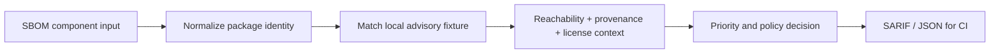

# Software Supply-Chain Risk and SBOM Intelligence

[](https://github.com/niketkrishnan/sbom-supply-chain-intelligence/actions/workflows/ci.yml)

A dependency-risk engine that keeps the **reason for a CI decision** beside the finding. It normalizes SBOM-style components, distinguishes direct from transitive reachability, considers provenance and license policy, and emits machine-readable output for developer workflows.

## Policy result from the committed fixture

The local report contains **3 components** and **2 findings**:

| Package context | Priority | Decision | Why it matters |
| --- | ---: | --- | --- |
| `requests 2.31.0` direct dependency | 1.00 | fail | high severity, exploitable signal, directly reachable |
| `transitive-parser 1.2.0` | 0.69 | warn | medium severity, transitive reachability, unverified provenance |

The identifiers are deliberately marked `CVE-DEMO-*` in [`artifacts/supply_chain_report.json`](artifacts/supply_chain_report.json). They are local fixture labels, not a live advisory feed.

## Reproduce the decision

```bash
python -m pip install -e '.[dev]'
python evaluate.py
pytest
```

The most useful review path is [`src/sbom.py`](src/sbom.py) → [`tests/test_sbom.py`](tests/test_sbom.py) → [`artifacts/supply_chain_report.json`](artifacts/supply_chain_report.json). The output explains why the policy is `fail` or `warn` instead of collapsing every issue into a severity-only list.

## A CI-oriented data path



The project is deliberately offline by default. A future OSV integration should be read-only, cached, rate-limit aware, and clearly separated from the deterministic policy engine.

## Why this is more than a vulnerability list

The same severity can demand different developer action depending on directness, provenance, reachability, and policy. This repository demonstrates that context as code, tests, and explainable output.

## Related security work

- [Explainable AI SOC Detection](https://github.com/niketkrishnan/explainable-ai-soc) — evidence-backed triage.
- [LLM Firewall and RAG Security Lab](https://github.com/niketkrishnan/llm-firewall-rag-security-lab) — AI application policy controls.
- [Cloud Attack-Path Prioritizer](https://github.com/niketkrishnan/cloud-attack-path-prioritizer) — graph-ranked exposure.
- [Identity Compromise Detector](https://github.com/niketkrishnan/identity-compromise-detector) — behavioral ML with privacy safeguards.
- [Portfolio site](https://github.com/niketkrishnan/HTML-Website) — recruiter-facing overview.

For security concerns, use a private GitHub Security Advisory or contact [@niketkrishnan](https://github.com/niketkrishnan). Never include private dependency manifests or credentials in issues.
